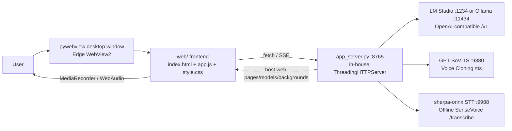

**English** | [中文](./README.zh.md)

A **purely local** desktop virtual character program: as you type or speak, the character uses your local **LLM** to process content, **GPT-SoVITS** to speak, and **STT** to understand your voice, while the Live2D model is rendered directly within the program window.

## Architecture



| Layer | Technology |
|---|---|
| Backend | Python standard library `http.server` (`ThreadingHTTPServer`) |
| Frontend | Pure HTML/JS/CSS (`web/`), rendering with `pixi.js` + `pixi-live2d-display` + `live2dcubismcore` |
| Desktop Shell | pywebview (Edge WebView2), frameless custom-drawn title bar |
| LLM | `openai` library → Local OpenAI-compatible endpoint (LM Studio / Ollama) |
| TTS | `requests` → GPT-SoVITS |
| STT | `requests` → Local sherpa-onnx service (SenseVoice offline / Paraformer streaming) |
| Memory | Standard library `sqlite3` + `jieba` tokenization + custom BM25 |

---

### 1. Install Dependencies

```bash
python -m venv .venv
.venv\Scripts\pip install -r requirements.txt
```

### 2. Start Three External Local Services

| Service | How to Start | Default Port |
|---|---|---|
| **LLM** | **LM Studio**: Load model → Developer → Start local server; or **Ollama**: `ollama serve` | `1234` / `11434` |
| **TTS** | GPT-SoVITS | `9880` |
| **STT** | Any external local STT service (recommended: [sherpa-onnx SenseVoice](https://github.com/k2-fsa/sherpa-onnx)), which provides a `POST /transcribe` endpoint returning `{"text": ...}` | `9988` |

> The program can still run even if none of the three services are running (though the LLM/TTS/STT status lights will be red); the status lights in the top bar display in real time whether each service is ready.

### 3. Configure Character

Open `config.py` and modify the key items as commented:

```python
# LLM
LM_STUDIO_BASE_URL = "http://localhost:1234/v1"   # or Ollama's :11434
LM_MODEL = ""                                     # Leave blank = automatically use the first available model

# TTS (Voice)
TTS_REF_AUDIO_PATH = ""        # Your reference audio (voice source), e.g., "assets/ref.wav"
TTS_PROMPT_TEXT   = ""         # The sentence spoken in the reference audio
TTS_PROMPT_LANG   = "zh"       # Language of the reference audio (zh / en)
TTS_TEXT_LANG     = "zh"       # Language of the synthesized text (zh / en)

# STT
STT_BACKEND = "api"            # "api" = external service
STT_API_URL = "http://127.0.0.1:9988/transcribe"

# Character
PERSONA_NAME = "01"            # Character name
MODEL_NAME   = "Akuru"         # Default Live2D model to load (folder name under `models/`)
```

Save your changes and rerun the program for them to take effect. You can also edit these settings live in the **⚙ Advanced Settings panel in the top-right corner** of the program (you’ll need to restart the program for changes to take effect after saving).

### 4. Run

```bash
.venv\Scripts\python main.py
```

> ⚠️ This project is a personal local application. By default, the reference audio paths and other settings in `config.py` are placeholders; please fill them in as needed. The copyright for the model assets belongs to their respective authors; they are used solely for local demonstration purposes.
