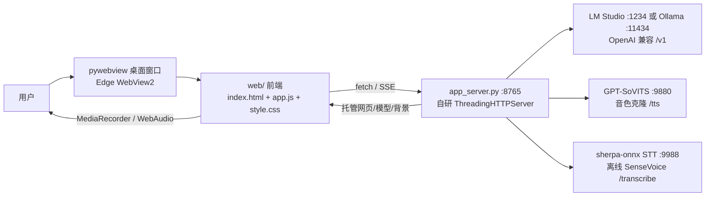

**中文** | [English](./README.md)

一个 **纯本地** 的桌面虚拟角色程序：你打字或说话，角色用你本机的 **LLM** 思考内容、用 **GPT-SoVITS** 说话、用 **STT** 听懂你的语音，Live2D 模型直接在程序窗口里渲染。

## 架构



| 层 | 技术 |
|---|---|
| 后端 | Python 标准库 `http.server`（`ThreadingHTTPServer`） |
| 前端 | 纯 HTML/JS/CSS（`web/`），`pixi.js` + `pixi-live2d-display` + `live2dcubismcore` 渲染 |
| 桌面壳 | pywebview（Edge WebView2），frameless 自绘标题栏 |
| LLM | `openai` 库 → 本地 OpenAI 兼容端点（LM Studio / Ollama） |
| TTS | `requests` → GPT-SoVITS |
| STT | `requests` → 本地 sherpa-onnx 服务（SenseVoice 离线 / Paraformer 流式） |
| 记忆 | 标准库 `sqlite3` + `jieba` 分词 + 手写 BM25 |

---

### 1. 安装依赖

```bash
python -m venv .venv
.venv\Scripts\pip install -r requirements.txt
```

### 2. 启动三个外部本地服务

| 服务 | 启动方式 | 默认端口 |
|---|---|---|
| **LLM** | **LM Studio**：加载模型 → 开发者 → 启动本地服务器；或 **Ollama**：`ollama serve` | `1234` / `11434` |
| **TTS** | GPT-SoVITS | `9880` |
| **STT** | 任意外部本地 STT 服务（推荐 [sherpa-onnx SenseVoice](https://github.com/k2-fsa/sherpa-onnx)），提供 `POST /transcribe` 返回 `{"text": ...}` | `9988` |

> 三个服务都没启动时程序也能开（只是 LLM/TTS/STT 状态灯为红），顶栏状态灯实时显示各项是否就绪。

### 3. 配置角色

打开 `config.py`，按注释修改关键项：

```python
# LLM
LM_STUDIO_BASE_URL = "http://localhost:1234/v1"   # 或 Ollama 的 :11434
LM_MODEL = ""                                     # 留空 = 自动用第一个可用模型

# TTS（音色）
TTS_REF_AUDIO_PATH = ""        # 你的参考音频（音色来源），如 "assets/ref.wav"
TTS_PROMPT_TEXT   = ""         # 参考音频里说的那句话
TTS_PROMPT_LANG   = "zh"       # 参考音频语言（zh / en）
TTS_TEXT_LANG     = "zh"       # 合成文本语言（zh / en）

# STT
STT_BACKEND = "api"            # "api"=外部服务
STT_API_URL = "http://127.0.0.1:9988/transcribe"

# 角色
PERSONA_NAME = "01"            # 角色名
MODEL_NAME   = "阿库露"         # 默认加载的 Live2D 模型（models/ 下文件夹名）
```

改完保存，重新运行程序即生效。也可以在程序**右上角 ⚙ 高级配置面板**里在线修改（保存后需重启生效）。

### 4. 运行

```bash
.venv\Scripts\python main.py
```

> ⚠️ 本项目为个人本地应用，默认 `config.py` 中的参考音频路径等为占位符，请按需填写。模型资产版权归各自作者所有，仅用于本地演示。
