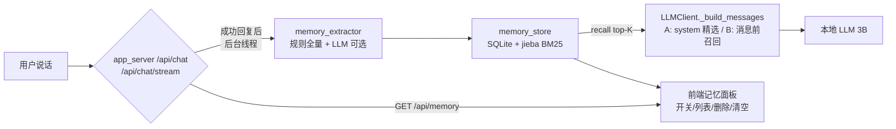

# 长期记忆：跨会话记住用户（SQLite + jieba BM25，零重依赖）

为应用新增"长期记忆"能力：从对话中提取值得记住的用户信息，跨会话持久化，
对话时按相关性召回并注入 LLM 上下文，让角色"越聊越懂你"。

## 决策（用户逐条确认，2026-08-21）

- **记忆单元**（Q1=C）：混合——能结构化（类别/键/值）的走 fact（姓名/喜好/身份…），
  提不出来的落自由笔记 note 兜底（如"叮嘱"类）。
- **提取策略**（Q2=C）：规则全量跑（零 token 成本），LLM 补充提取可选
  （每 N 条消息 或 信号词触发，异步执行、失败静默）。默认 `MEM_LLM_EXTRACT=False`，
  规则够用就不开；模型可切换但 3B 也可用。
- **存储/检索**（Q3=A）：stdlib `sqlite3` + `jieba`（纯 Python）+ 手写 BM25 关键词检索。
  新增依赖只有 jieba（约 15-20MB），无首次模型下载、离线 100% 成立、exe 打包无感。
- **注入**（Q4=C，A+B 双轨）：system prompt 放"精选长期记忆"（top 重要度）；
  当前用户消息前放"本次召回 top-K"（含历史值，让 LLM 能说出"你以前喝咖啡现在喝茶"）。
- **冲突**（Q5=C）：同 (category,key) 的 fact 覆盖主值，旧值推入 history（最多保留
  `MEM_HISTORY_KEEP=5` 条），可追溯。
- **遗忘**（Q6=A）：容量上限 `MEM_MAX_ENTRIES=1500`（≈ 三个月对话量）+
  重要性淘汰（importance = 规则/AI 基础分 + 命中次数加成），淘汰最低分者。
- **角色隔离**（Q7=A）：全局一份记忆，先不做按角色分库。
- **前端**（Q8=A）：高级配置面板（cfg-panel）内嵌"长期记忆"区块——开关、条数、
  记忆列表（单条删除）、清空按钮；只 append 样式、复用现有白粉变量。

## 技术选型（2026-08 调研）

| 方案 | 依赖重量 | Py3.13 | exe打包 | 离线 | 中文 | 结论 |
|---|---|---|---|---|---|---|
| ChromaDB | 重（onnxruntime/pydantic/fastapi…） | ✅ | 差（C++ 扩展） | 需下载默认嵌入 | 需外挂 | 桌面小应用过重 |
| FAISS | 中（C++ wheel） | ✅ | 中 | 无 | 只存向量 | 需自管元数据，过度 |
| LanceDB | 重（Rust+pyarrow） | ✅ | 差 | 需下载嵌入 | 一般 | 打包痛苦 |
| sqlite-vec | 轻（单 C 文件） | ✅ | 中（需捆 dll） | 无 | 纯向量 | 仍 pre-v1，风险 |
| fastembed | 重（onnxruntime） | 未确认 | 差 | **需下载** | 优 | 首跑必联网，违背约束 |
| **jieba+BM25（采用）** | **极轻（纯 .py+词典）** | ✅ | **极好** | **无** | **优** | **本项目最优** |

> 选型结论：本项目是"全本地、零联网、exe 打包、3B 小 LLM"的桌面应用，
> 向量库的语义检索收益 < 依赖体积/打包/离线约束的代价。
> jieba+BM25 零编译零下载，中文词典分词质量好，足以支撑关键词召回；
> 未来要语义检索时，可在 retriever 接口处替换为 sqlite-vec/fastembed（已预留）。

## 架构



数据流：用户说话 → 回复成功后 `_extract_memories_async`（后台线程，不阻塞
TTS/UI/SSE）→ 规则提取（+LLM 可选）→ `MemoryStore.add`（覆盖/追加+历史）→
下次对话 `recall()` BM25 检索 → 注入 system 与当前消息前 → LLM 生成。

## 核心模块

- `memory_store.py`：`MemoryStore`（SQLite+索引+增删查搜+淘汰）、`BM25Index`
  （手写倒排索引，纯 Python）、`tokenize`（jieba 词 + CJK 单字，缺失降级 bigram）。
- `memory_extractor.py`：`extract_rules`（中英规则表）、`extract_with_llm`
  （可选 LLM 提取，容错 JSON 解析）、`has_signal`（信号词）。
- `memory.py`：`MemoryManager` 门面——`ingest/ingest_async/recall/top_important/
  format_user/format_system/list/delete/clear`。
- `llm_client.py`：`LLMClient.__init__` 增加 `memory` 参数（None=零侵入）；
  `_build_messages` 注入 A+B 双轨，全部 try/except 兜底。
- `app_server.py`：`get_memory()` 懒加载（失败降级 None）、`_extract_memories_async`、
  `GET /api/memory`、`POST /api/memory/delete|clear|toggle`；`get_editable_config`
  暴露记忆配置。

## 数据库 Schema

```sql
CREATE TABLE memories (
    id INTEGER PRIMARY KEY AUTOINCREMENT,
    category TEXT NOT NULL DEFAULT 'note',  -- name/preference/dislike/identity/plan/fact/note
    key TEXT NOT NULL DEFAULT '',           -- 结构化键（note 无键）
    value TEXT NOT NULL,
    kind TEXT NOT NULL DEFAULT 'fact',      -- fact（可覆盖）/ note（追加）
    importance REAL NOT NULL DEFAULT 5.0,   -- 基础重要度
    hits INTEGER NOT NULL DEFAULT 0,        -- 命中次数（越用越重要）
    created_at TEXT NOT NULL,
    updated_at TEXT NOT NULL,
    history TEXT NOT NULL DEFAULT '[]'      -- JSON 旧值数组 [{value, at}]
);
```

## 配置项（config.py 新增）

| 键 | 默认 | 说明 |
|---|---|---|
| `MEMORY_ENABLED` | `True` | 总开关（False=完全不提取/注入/存储） |
| `MEMORY_DB_PATH` | `memory.db` | 记忆库路径（相对 BASE_DIR，纯本地） |
| `MEM_LLM_EXTRACT` | `False` | LLM 补充提取（默认关，规则够用） |
| `MEM_LLM_EXTRACT_EVERY` | `10` | LLM 提取频率（每 N 条消息） |
| `MEM_RETRIEVE_TOP_K` | `5` | 当前消息前注入的召回条数 |
| `MEM_SYSTEM_MEMORIES` | `3` | system prompt 精选记忆条数 |
| `MEM_MAX_ENTRIES` | `1500` | 容量上限（≈三个月对话量），超出淘汰低重要度 |
| `MEM_HISTORY_KEEP` | `5` | 同一事实历史值保留条数 |

## 测试与验证

- `tests/test_memory.py`（36 用例）：分词/BM25 排序、中英规则提取、
  覆盖保留历史、note 追加不覆盖、关键词检索、命中计数、删除/清空、
  容量淘汰（重要记忆保留）、Manager 集成、注入格式含历史值、
  禁用零侵入、LLM JSON 容错解析、LLM 失败静默、LLMClient 双轨注入、
  记忆异常静默、重启持久化。
- 全量回归：`pytest` → **119 passed**（原 79 + 新增 40）。
- 手动验证：启动程序 → 聊"我叫小红，最喜欢喝奶茶" → 打开高级配置 →
  "长期记忆"区显示已记住条目 → 重启程序 → 问"你记得我喜欢喝什么吗"，
  角色能引用记忆（含历史值）。

## 风险与应对

| 风险 | 应对 |
|---|---|
| jieba 缺失/损坏 | tokenize 降级字符 bigram，存储照常；MemoryStore 初始化异常 → 整体禁用 |
| 记忆膨胀 | 容量上限 + 重要性淘汰；前端可手动删除/清空 |
| 注入超长挤占上下文 | top-K 默认 5、system 精选 3，均为小量；value 截断 50 字 |
| 召回不相关 | BM25 关键词 + hits 加成（越用越重要）；信号词/LLM 提取可选增强 |
| 3B 模型 LLM 提取不稳 | 默认关闭；JSON 容错解析；失败静默 |
| 并发写库 | 全程 `RLock` 保护 + WAL 模式，读写分离 |

## 待办/未来优化

1. 语义检索升级：retriever 接口处换 sqlite-vec/fastembed（bge-small-zh），
   但需解决"首跑模型下载"与离线约束的取舍。
2. 按角色分库（PERSONA_NAME 参数化库名）。
3. 记忆去重/合并：相似 note 自动合并。
4. 主动回忆：闲聊时角色主动提及记忆（需要 LLM 侧引导）。
